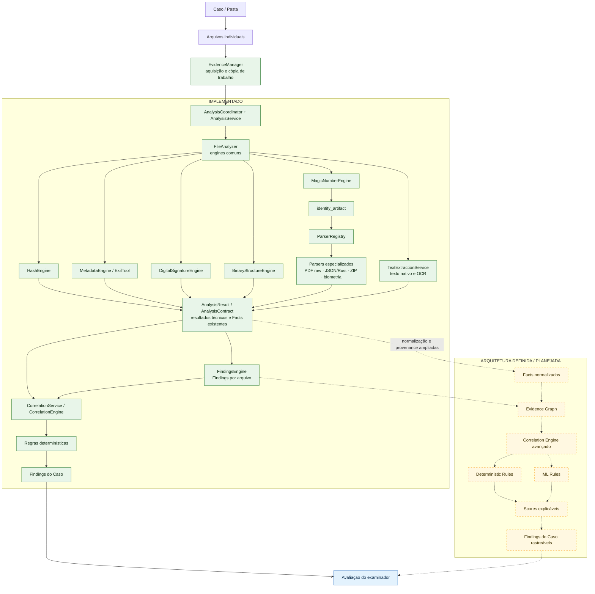

<p align="center">


</p>

# ForensiHash PRO

Plataforma privada de apoio à perícia digital, desenvolvida em Python 3.12 e PySide6, para análise técnica de arquivos digitais, integridade, rastreabilidade, preservação da evidência e correlação de vestígios.

> Projeto privado e proprietário em desenvolvimento (Beta).

```text
arquivo → estrutura → vestígios → contexto → correlação → interpretação técnica
```

> O ForensiHash organiza, correlaciona e apresenta vestígios técnicos. A interpretação conclusiva permanece sob responsabilidade do examinador.

O software não declara fraude, autenticidade, autoria ou responsabilidade. Eventos isolados — como múltiplos `%%EOF`, assinaturas binárias internas ou bytes após o último EOF — são observações técnicas, não conclusões automáticas.

## Visão geral

Uma pasta pode ser tratada como um **Caso**. Cada arquivo é adquirido em uma cópia de trabalho, analisado individualmente e depois correlacionado com os demais artefatos do conjunto.

```text
Caso / Pasta
    ↓
Analysis Pipeline
    ↓
Correlation Engine
    ↓
Findings do Caso
```

Esta documentação distingue:

- **Implementado:** existe código integrado no repositório atual.
- **Arquitetura definida:** princípios e contratos conceituais documentados, ainda sem cobertura executável completa.
- **Planejado:** direção futura, não disponível como funcionalidade atual.

## Fluxo de análise dos arquivos



Linhas contínuas e nós verdes representam o fluxo implementado. Linhas tracejadas e nós amarelos representam arquitetura definida ou planejada, ainda sem cobertura executável completa. Parsers especializados são executados conforme o tipo de arquivo identificado e o suporte disponível na versão e no ambiente.

## Núcleo de análise — implementado

- `EvidenceManager`: aquisição, SHA-256 durante a cópia, cópia de trabalho somente leitura e verificação posterior da fonte e da cópia.
- `AnalysisCoordinator`, `AnalysisService` e `FileAnalyzer`: orquestração do pipeline, perfis, estados e preservação de resultados parciais.
- `HashEngine`: MD5, SHA-1, SHA-224, SHA-256, SHA-384 e SHA-512 por leitura incremental.
- `MetadataEngine`: extração por ExifTool, quando disponível.
- `MagicNumberEngine`: identificação pela assinatura binária e comparação com a extensão.
- `DigitalSignatureEngine`: identifica assinaturas PDF incorporadas e dados disponíveis do certificado; não realiza validação criptográfica completa.
- `PDFStructureEngine`: inventário básico da estrutura PDF.
- `BinaryStructureEngine`: `BinaryReader`, strings, assinaturas, entropia e `PdfRawParser`.
- `DeepFileStructureEngine`: núcleo Rust opcional para inspeção profunda de PDF e JPEG.
- `TextExtractionService`: texto nativo e OCR de PDF/imagens.
- `FindingsEngine`: regras técnicas sobre resultados de arquivo.
- `JsonParserService`: adaptador do parser Rust para JSON, JSONL e NDJSON.
- `BiometricReportService`: parsers Aware/Knomi, perfis, métricas e restrições declaradas.
- `ParserRegistry`: seleção por tipo identificado e inspeção limitada de ZIP.
- `TimelineService`, serviços de entidades, IP e comparação, além das engines de correlação de Caso.
- `BinaryStructurePage`, Deep File Explorer e visualizadores HEX.

ExifTool, Tesseract, Poppler e o módulo Rust são componentes opcionais ou externos; indisponibilidade, falha, resultado parcial e não aplicabilidade são estados distintos.

## Hash e integridade

O `EvidenceManager` registra a identidade da fonte, copia e calcula SHA-256 simultaneamente, compara fonte e cópia, entrega ao pipeline uma cópia somente leitura e verifica ambas ao final. O `HashEngine` calcula os demais hashes por blocos. O Magic Number registra o tipo indicado pelos bytes e sua compatibilidade com a extensão.

Hash estável, extensão compatível e assinatura reconhecida são fatos técnicos específicos; isoladamente, não demonstram autenticidade integral.

## Metadados

O ExifTool pode fornecer `Creator`, `Producer`, `CreateDate`, `ModifyDate`, software identificado, EXIF, GPS e dados de dispositivo.

> Metadados são vestígios declarados pelo arquivo e devem ser interpretados juntamente com a estrutura e demais elementos.

Datas, coordenadas e nomes de software exigem contexto, fuso e provenance. Ferramenta indisponível ou campo ausente não é contradição.

## PDF Structural Engine

A implementação atual possui camadas complementares:

- `PDFStructureEngine`: versão/header, objetos, streams, XREF tradicional/stream, trailer, `startxref`, `%%EOF`, criptografia, actions/JavaScript, embedded files, AcroForm, linearização e indícios de atualizações incrementais;
- `PdfRawParser`: offsets de objetos indiretos, streams, XREF, trailers, `startxref`, EOF, `/Prev`, bytes após EOF, embedded files, AcroForm/XFA e outros marcadores;
- núcleo Rust opcional: páginas, árvore de páginas, Resources, imagens, XObjects aninhados, AcroForm, annotations, embedded files, signatures, metadata streams/XMP, objetos e referências entre objetos.

A presença de uma estrutura é distinta da validação de seu conteúdo. Como evolução planejada, a proveniência navegável deverá incluir caminhos como:

```text
Page
└── Resources
    └── Properties
        └── MC0
            └── Metadata
                └── XMP
```

O objetivo futuro é responder o que existe, onde o objeto é usado, qual página/recurso o referencia e quais são sua proveniência e relações. Essa cobertura completa não deve ser presumida onde o parser atual ainda não alcança.

## Binary / Deep File Analysis

Estão implementados leitura por intervalos, header/footer em HEX, extração limitada de strings ASCII e UTF-16LE, scanner de assinaturas, entropia por regiões, parser PDF raw, grade/visualizador HEX e análise profunda opcional de PDF/JPEG em Rust. O scanner relata ocorrências de bytes; não presume que assinaturas internas sejam arquivos válidos. **Carving completo é planejado, não implementado.**

## Texto e OCR

O `TextExtractionService` extrai texto nativo de PDFs e aplica OCR quando necessário e disponível; também processa imagens suportadas. Segmentos preservam método de origem e página, e limites/falhas parciais são registrados.

O repositório já possui um contrato `Fact`. Como **arquitetura definida**, Facts normalizados deverão representar, por exemplo:

```text
operation_date = 2024-06-04
contract_id    = 000577773689
ip_address     = 201.7.165.0
release_date   = 2024-06-19
```

Cada Fact deverá preservar tipo, valor, arquivo, página/localização, método de extração, `confidence` quando aplicável e `provenance`, sem apagar valor ou origem original.

## IP e contexto de rede

O projeto extrai IPv4/IPv6 de texto nativo, OCR e dados estruturados. Classifica públicos, privados, loopback, link-local, reservados, multicast, não especificados e **CGNAT**. Uma integração externa configurável pode acrescentar ASN, provedor e geolocalização aproximada.

Geolocalização por IP não determina localização física precisa. NAT, CGNAT, VPN, proxy, redes móveis, topologia e qualidade da base limitam a interpretação.

## JSON, logs, arquivos e biometria

O `JsonParserService` usa o núcleo Rust opcional, com limites e resultados estruturados; regras atuais aproveitam campos JSON. ZIP possui inspeção segura e limitada. Relatórios biométricos Aware/Knomi têm parser, normalização de métricas e avaliação de restrições declaradas; esses resultados não substituem conclusão biométrica do examinador.

Não existe parser genérico completo de logs ou XML. JSON e futuros artefatos estruturados poderão alimentar o Correlation Engine.

## Timeline técnica

Datas conservam papéis semânticos diferentes:

```text
04/06/2024 → operation_date
18/06/2024 → pdf_modify_date
19/06/2024 → fund_release_date
```

`CreateDate`, `ModifyDate`, aceite, emissão, operação e liberação não são timestamps semanticamente equivalentes. Ordenação cronológica não autoriza tratá-los como o mesmo evento ou relógio.

## Case Correlation Engine

A implementação atual consolida resultados sem repetir OCR, análise técnica ou consultas externas. Correlaciona hashes calculados/declarados, entidades (incluindo CPF/CNPJ e identificadores), IP, datas contratuais, metadados, assinatura, produtor, timeline, JSON e relações entre texto nativo e OCR. A correlação V2 possui providers de hash, texto, OCR, entidades resolvidas, IP, metadados, JSON e timeline, com identidade estável, normalização, provenance e relações explicáveis.

Estados conceituais para correlações atuais e futuras:

- `MATCH`: fatos comparáveis correspondem segundo a regra.
- `MISMATCH`: fatos comparáveis divergem segundo a regra.
- `UNKNOWN`: evidência insuficiente ou indeterminada.
- `NOT_APPLICABLE`: comparação não aplicável ao contexto.

> Ausência de informação não equivale automaticamente a contradição.

Como evolução arquitetural, o Caso deverá ampliar correlações por hash, ContractID, CPF/CNPJ, identificadores, IP, porta, timestamps, session ID, transaction ID, filename, referências entre arquivos, XMP, provenance, relações temporais, JSON/XML/logs e recursos compartilhados. A lista completa não representa cobertura atual de ponta a ponta.

## ML + Evidence Correlation

**Estado: arquitetura definida / em planejamento. Um modelo de ML não é apresentado como implementado.**

```text
Arquivo
   ↓
Parser determinístico
   ↓
Facts normalizados
   ↓
Evidence Graph
   ↓
Correlation Engine
   ├── Deterministic Rules
   └── ML Rules
   ↓
Scores explicáveis
   ↓
Findings
   ↓
Avaliação do examinador
```

O ML não será usado para declarar fraude, autenticidade, autoria ou responsabilidade. Deverá auxiliar triagem, anomaly detection, clustering, document families, similarity, pattern discovery, sugestão de relações não óbvias e priorização de revisão.

Scores conceituais: Structural Score, Metadata Consistency Score, Temporal Consistency Score, Internal Correlation Score, Cross-File Correlation Score, Evidence Coverage e Case / Folder Correlation Score.

> Scores representam consistência, anomalia, cobertura ou força de correlação técnica. Não representam probabilidade de fraude, autenticidade, autoria ou responsabilidade.

Consulte [ForensiHash — ML Rules](docs/architecture/ml/ML_RULES.md).

### Automatic Evidence Linking — arquitetura futura

O ForensiHash poderá relacionar SHA-256/outros hashes, `DocumentID`, `InstanceID`, XMP `DerivedFrom`, ContractID, CPF/CNPJ, UUID, IP, porta, session ID, transaction ID, account ID, device ID, filename, embedded filename, timestamps, referências JSON/XML e referências entre objetos.

```text
exact match → normalized match → semantic/fuzzy match → ML similarity
```

Relacionamentos determinísticos sempre devem ter prioridade.

### Evidence Graph — arquitetura futura

Nodes possíveis: `File`, `Fact`, `Event`, `Entity`, `Device`, `Network`, `Document` e `Resource`.

Edges possíveis: `contains`, `references`, `matches`, `contradicts`, `derived_from`, `generated_by`, `occurred_before`, `occurred_after`, `same_identifier`, `same_hash` e `same_session`.

Todo score/finding deverá ser rastreável:

```text
Case Score → Category Score → Relationship → Finding → Fact
→ Parser Result → File / Object / Field
```

Facts, provenance e relações já existem parcialmente na correlação V2; o Evidence Graph completo como fonte canônica e a camada ML são planejados.

## Ambiente local

```powershell
py -3.12 -m venv .venv
.\.venv\Scripts\python.exe -m pip install --upgrade pip
.\.venv\Scripts\python.exe -m pip install -r requirements.txt
.\.venv\Scripts\python.exe main.py
```

`config/settings.json` é configuração local ignorada pelo Git. A IP2Location usa `IP2LOCATION_ENABLED` e `IP2LOCATION_API_KEY` no ambiente. `.env.example` é apenas catálogo e não deve conter segredos. ExifTool, Tesseract e Poppler são detectados no bundle/PATH ou configurados pelas variáveis documentadas. O núcleo Rust opcional requer Rust/Cargo e maturin para desenvolvimento.

## Evolução planejada

- proveniência e relacionamentos mais profundos em PDF;
- carving com limites e cadeia de derivação;
- parsers adicionais, inclusive OpenXML, XML e logs;
- Facts normalizados e Evidence Graph;
- Automatic Evidence Linking e ML assistivo explicável;
- melhorias de exportação, snapshots e experiência de análise.

## ForensiHash e DDNA

O **ForensiHash** é a plataforma de análise técnica. **DDNA / Document DNA** é uma iniciativa distinta e em desenvolvimento. Conceitos ou protótipos DDNA não são funcionalidades implementadas no ForensiHash.

## Projeto privado e proprietário

> Este é um projeto privado e proprietário.

Código-fonte, arquitetura, regras, documentação, identidade visual e conceitos de produto não são disponibilizados sob licença open source, salvo indicação expressa e formal do titular. A presença deste repositório ou de dependências de terceiros não concede licença de uso, cópia, modificação ou distribuição.

## Aviso técnico

Os resultados são fatos, observações e correlações técnicas que devem ser avaliados com as demais evidências e limitações do Caso. O ForensiHash não substitui a análise pericial.

## Criação e desenvolvimento

**Criado e desenvolvido por Rodrigo Galvão.**
